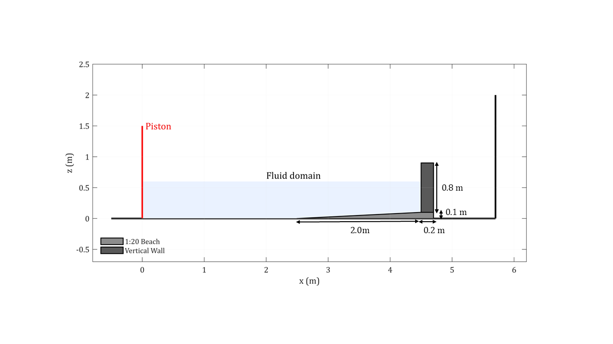
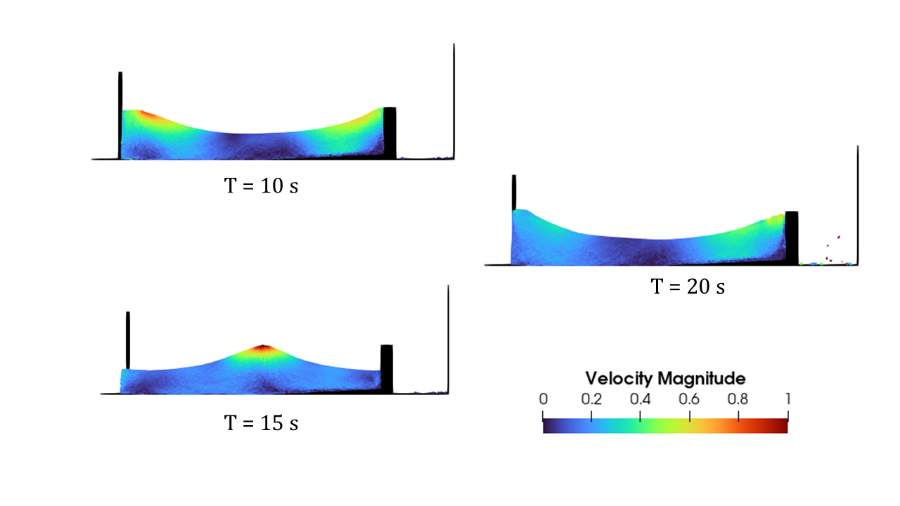
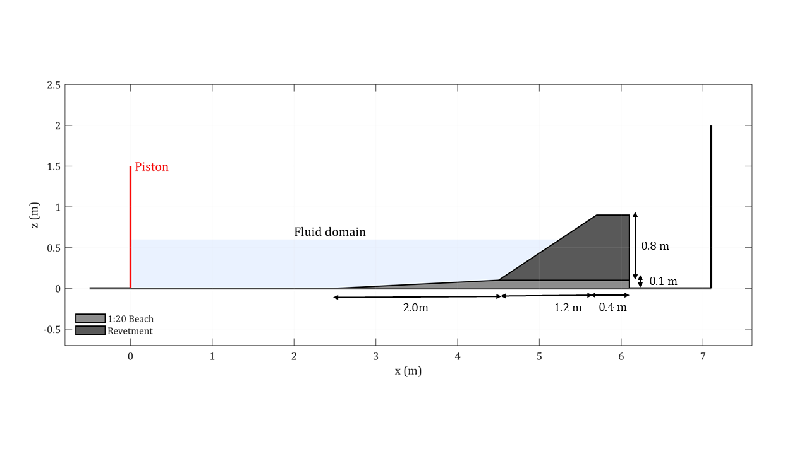
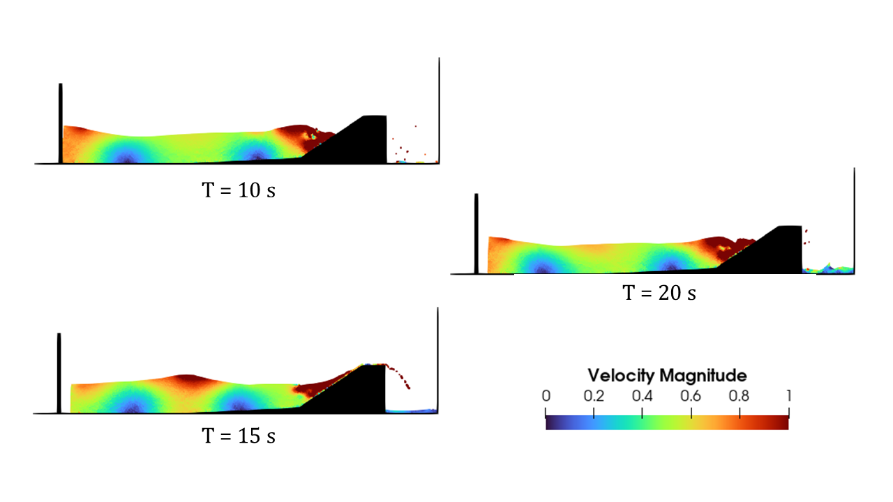
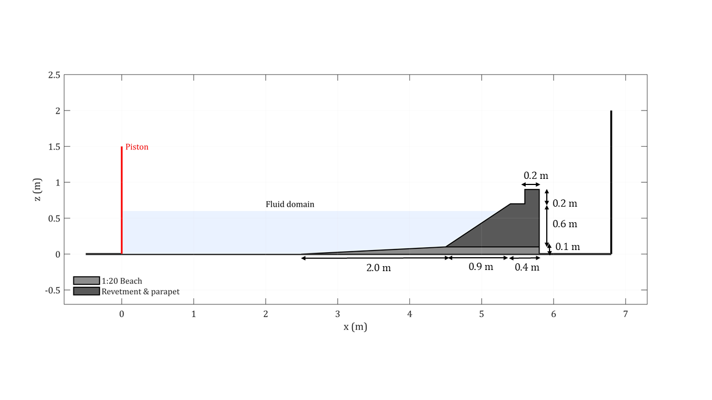
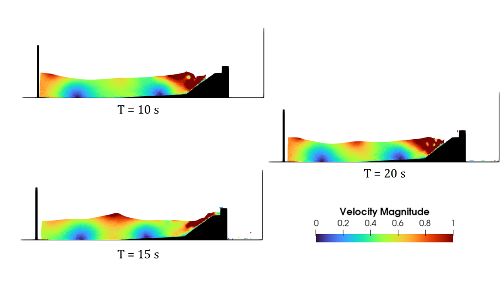
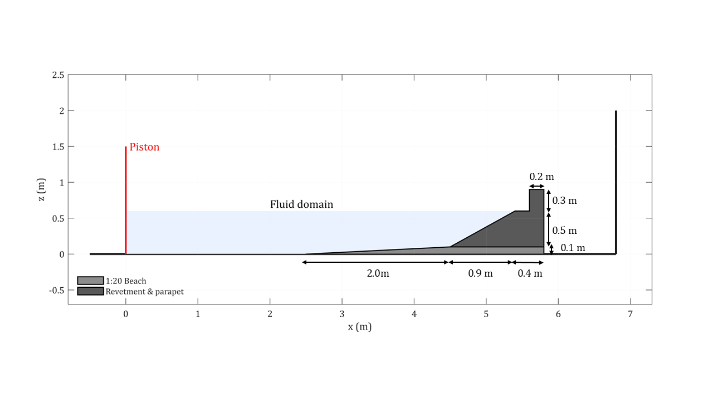
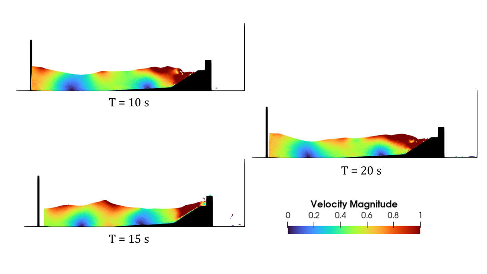
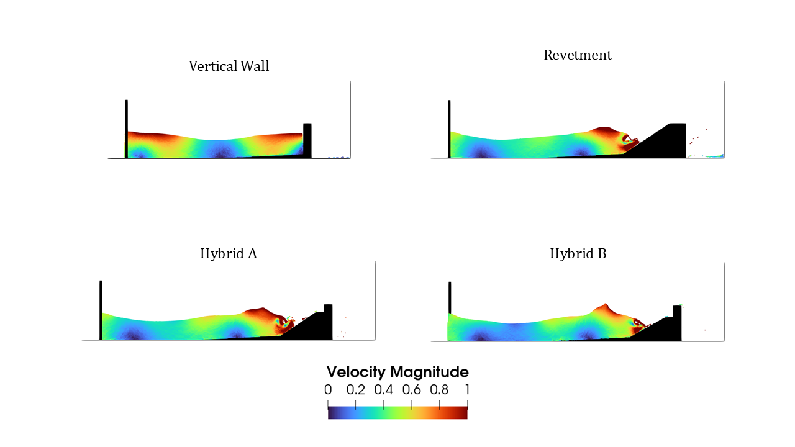

# Optimal Design of Coastal Defences using SPH

**MSc Advanced Aerospace Engineering Dissertation | University of Liverpool (2025)**

[]()
[]()
[]()
[]()

> **Grade: High Distinction (Top Student Award, 84% MSc Average)**

---

## Overview

As sea levels are projected to rise by up to 1.1 m by 2100, existing coastal defences face increasing risk of failure through overtopping and structural damage. This dissertation uses **Smoothed Particle Hydrodynamics (SPH)** to evaluate four coastal defence geometries in a 2D numerical wave flume, quantifying the trade-off between wave overtopping prevention and horizontal structural loading.

A vertical seawall benchmark case was validated against published SPH and analytical solutions (average error <2%), then a comparative analysis was run across four defence configurations under four wave conditions. The results were assessed against **EurOtop (2018)** discharge limits to identify which configurations meet both stability and overtopping criteria.

## Defence Geometries

Four configurations were modelled and compared:

### Vertical Seawall
| | |
|---|---|
|  |  |

Full wave reflection. Minimal overtopping across all conditions (0.026 m³ in the most severe case), but high horizontal loading.

### Impermeable Revetment (Sloped)
| | |
|---|---|
|  |  |

Slope dissipates wave energy and consistently produces the lowest horizontal loading across all wave conditions. However, it allows the highest overtopping volumes (0.168 m³ under T7), exceeding EurOtop limits.

### Hybrid A (Revetment + Raised Parapet)
| | |
|---|---|
|  |  |

Parapet crest 0.1 m above Still Water Level (SWL). Combines the energy dissipation of the slope with the reflection capability of the parapet. Reduces overtopping by 64% compared to the bare revetment under T7 conditions.

### Hybrid B (Revetment + Parapet at SWL)
| | |
|---|---|
|  |  |

Parapet crest at SWL. Further reduces overtopping compared to the revetment, but the lower parapet position generates significantly higher horizontal forces under severe wave conditions (4541.94 N/m under T7).

### All Configurations Compared



## Results

### Maximum Horizontal Forces [N/m]

| Wave Condition | Wall | Revetment | Hybrid A | Hybrid B |
|:-:|--:|--:|--:|--:|
| **G1** | 1702.44 | 1585.02 | 1608.61 | 1757.58 |
| **G2** | 1788.16 | 1638.33 | 1652.90 | 1611.59 |
| **T4** | 2593.93 | 2556.00 | 2732.19 | 2885.80 |
| **T7** | 2680.54 | 2261.50 | 3338.15 | 4541.94 |

Under mild conditions (G1, G2), all four geometries produce comparable loading (1585–1788 N/m). Under severe breaking wave conditions (T7), Hybrid B experiences the highest loading (4541.94 N/m) due to wave-parapet interaction at the still water level.

### Overtopping Volume [m³]

| Wave Condition | Wall | Revetment | Hybrid A | Hybrid B |
|:-:|--:|--:|--:|--:|
| **G1** | 0.0000 | 0.0000 | 0.0000 | 0.0000 |
| **G2** | 0.0000 | 0.0000 | 0.0000 | 0.0000 |
| **T4** | 0.0072 | 0.1012 | 0.0084 | 0.0072 |
| **T7** | 0.0264 | 0.1684 | 0.0613 | 0.0393 |

No overtopping occurs under G1 and G2 conditions for any geometry. Under breaking wave conditions (T4, T7), the revetment allows the highest overtopping (0.1684 m³ under T7), while the vertical seawall allows the least (0.0264 m³). Hybrid B reduces revetment overtopping by 77%, and Hybrid A by 64%.

### Key Findings

- **The Parapet Effect**: Adding a vertical parapet to a revetment significantly reduces overtopping. Even the lower parapet (Hybrid B) cuts revetment overtopping by 77% under T7 conditions.
- **The Trade-off**: Parapet position matters. Hybrid B achieves lower overtopping than Hybrid A, but at the cost of dramatically higher horizontal loading (4541.94 vs 3338.15 N/m under T7). Placing the parapet at the still water level exposes it to direct wave impact.
- **Revetment Limitation**: The bare revetment consistently produces the lowest structural loading, but its overtopping volumes under breaking waves (0.10–0.17 m³) exceed EurOtop discharge limits, making it unsuitable as a standalone defence.
- **Validation**: Benchmark seawall case reproduced published SPH and analytical results with <2% average error.

## Numerical Framework

| Parameter | Details |
|-----------|---------|
| SPH Solver | DualSPHysics (Weakly Compressible SPH) |
| Kernel | Wendland |
| Integration | Symplectic scheme |
| Boundary Conditions | Modified Dynamic Boundary Conditions (mDBC) |
| Domain | 2D numerical wave flume |
| Wave Conditions | 4 cases (G1, G2, T4, T7) covering mild to severe breaking waves |
| Validation | <2% error vs analytical linear wave theory + published experimental data |
| Industry Standard | EurOtop (2018) overtopping discharge limits |

## Repository Structure

```
├── README.md
├── MSc_Dissertation_Report.pdf         # Full technical dissertation
├── Case_Files/
│   ├── Wall_Def.xml                    # Vertical seawall DualSPHysics input
│   ├── Dike_Def.xml                    # Sloped revetment DualSPHysics input
│   └── Hybrid_Def.xml                  # Hybrid configurations DualSPHysics input
├── Post-Processing_Scripts/
│   ├── OvertoppingVolume_Extraction.py # Overtopping volume from flowtool output
│   ├── MaxForces_Extraction.py         # Peak horizontal force extraction
│   └── CheckSumOfForces_DikeParapet.m  # Force balance validation (MATLAB)
└── Visuals/
    ├── AllCase_Velocity.PNG            # Comparative velocity fields
    ├── Seawall_Domain.PNG / _Velocity.PNG
    ├── Revetment_Domain.PNG / _Velocity.PNG
    ├── HybridA_Domain.PNG / _Velocity.PNG
    └── HybridB_Domain.PNG / _Velocity.PNG
```

## Tools

| Tool | Purpose |
|------|---------|
| [DualSPHysics](https://dual.sphysics.org/) | SPH simulation (wave-structure interaction) |
| ParaView | Flow visualisation and velocity field extraction |
| Python | Overtopping volume and force extraction automation |
| MATLAB | Force summation and structural loading analysis |
| Linux HPC | Parallel simulation execution |

## Contact

**Wei Jun Yap**
- Email: wjyapuni@gmail.com
- LinkedIn: [linkedin.com/in/wjunyap](https://linkedin.com/in/wjunyap)